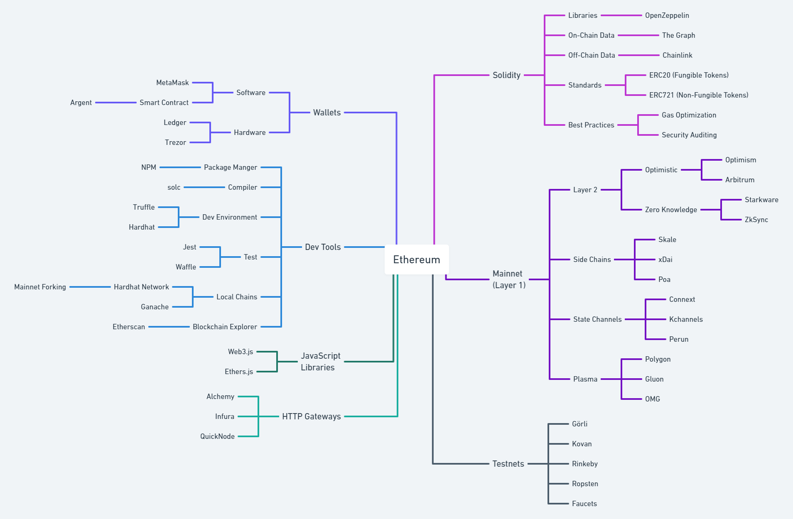

A basic introduction to Web3 and its concepts.

The target audience is **frontend developers**, who have at least an average grasp of JavaScript and
Web2 technology.

> If you don't know much about Web development, because you come from another industry or you're
> just beginning your programmer journey, I strongly recommend checking out
> [FreeCodeCamp](https://www.freecodecamp.org/learn/). After finishing the Web design, JavaScript
> algorithms, and front end development courses, you should be up to speed to take this Web3 course.

**This course is in progress and help is appreciated!**

## Lessons

This course goes step by step through the Web3 concepts from a Web apps point of view. So, (almost)
**no Solidity or dev-tools are required** for the first two parts.

You are **just writing JavaScript for the browser**.

There is even a small code editor that lets you **try out code right on the page**.

Every part finishes with an example app where you can apply your new knowledge right away.

### Part I: Reading Data from a Blockchain Network

The first part is about the basics, connecting to a blockchain network, reading data, etc.
You only need a modern browser and that's it.

- [00 Connecting to a Blockchain Network](https://kay-is.github.io/web3-from-zero/00-connect-to-blockchain.html)
- [01 Reading an Address Data](https://kay-is.github.io/web3-from-zero/01-read-address-data.html)
- [02 Connecting to Smart Contracts](https://kay-is.github.io/web3-from-zero/02-connect-to-contracts.html)
- [03 Using the Ethereum Name Service](https://kay-is.github.io/web3-from-zero/03-using-ens.html)
- [04 Ethereum Request for Comment](https://kay-is.github.io/web3-from-zero/04-ercs.html)
- [05 First Example App](https://kay-is.github.io/web3-from-zero/05-example-app.html)

### Part II: Writing Data to a Blockchain Network (WIP)

The second part is about getting more interactive, you will need to install a wallet extension to
your browser and create your first accounts.

- [06 Public & Private Keys](https://kay-is.github.io/web3-from-zero/06-public-and-private-keys.html)
- [07 Externally Owned Accounts](https://kay-is.github.io/web3-from-zero/07-externally-owned-accounts.html)
- [08 Crypto Wallet Setup](https://kay-is.github.io/web3-from-zero/08-crypto-wallet-setup.html)
- [09 Test Networks](https://kay-is.github.io/web3-from-zero/09-test-networks.html)
- 10 Sending Transactions
- 11 Second Example App

## Ethereum Edition

This is the Ethereum edition, which uses the Ethereum network as an example.

The Ethereum ecosystem is a vast landscape if you're just starting out, you might be dazzled by all the networks, dev environments, wallets, and whatnot.

This introduction will help you to make sense of this all, talking about one concept per lesson.
